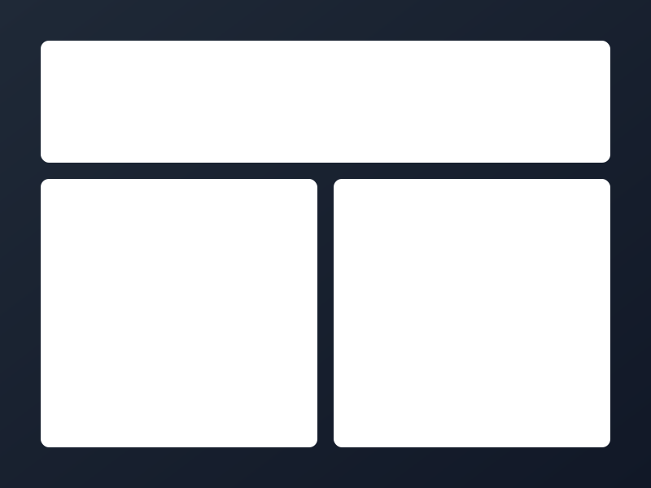

# 💫 Welcome to FinanceAI

<div align="center">
  
  
  [](https://financeai.vercel.app)
  [](https://railway.app)
  [](https://www.typescriptlang.org/)
  [](https://nextjs.org/)
  [](https://fastapi.tiangolo.com/)
</div>

## 🎯 Project Overview

FinanceAI is a cutting-edge financial analytics platform that combines modern design principles with powerful AI capabilities. Our mission is to democratize financial intelligence through an intuitive and beautiful interface.

<div align="center">
  
</div>

## 🚀 Quick Start Guide

### Prerequisites

- Node.js (v18 or higher)
- Python (v3.10 or higher)
- pnpm (v8 or higher)
- Git

### Frontend Setup

```bash
# Clone the repository
git clone https://github.com/yourusername/financeai.git
cd financeai

# Install frontend dependencies
cd frontend
pnpm install

# Create .env.local file
cp .env.example .env.local

# Start development server
pnpm dev
```

### Backend Setup

```bash
# Navigate to backend directory
cd backend

# Create and activate virtual environment
python -m venv venv
source venv/bin/activate  # On Windows: .\venv\Scripts\activate

# Install dependencies
pip install -r requirements.txt

# Create .env file
cp .env.example .env

# Start backend server
uvicorn main:app --reload
```

## 🎨 UI/UX Design Philosophy

Our design system follows these core principles:

### 1. Visual Hierarchy 📊
```typescript
// Example of our chart component with proper visual hierarchy
const ChartComponent = () => (
  <ResponsiveContainer width="100%" height={300}>
    <AreaChart data={marketData}>
      <defs>
        <linearGradient id="colorUv" x1="0" y1="0" x2="0" y2="1">
          <stop offset="5%" stopColor="#8884d8" stopOpacity={0.8}/>
          <stop offset="95%" stopColor="#8884d8" stopOpacity={0}/>
        </linearGradient>
      </defs>
      <Area type="monotone" dataKey="value" stroke="#8884d8" fillOpacity={1} fill="url(#colorUv)" />
    </AreaChart>
  </ResponsiveContainer>
);
```

### 2. Responsive Design 📱
Our components adapt seamlessly across devices:

```typescript
const DashboardCard = styled.div`
  @media (max-width: 768px) {
    grid-column: span 12;
  }
  @media (min-width: 769px) {
    grid-column: span 6;
  }
  @media (min-width: 1024px) {
    grid-column: span 3;
  }
`;
```

### 3. Micro-interactions ✨
Subtle animations enhance user experience:

```typescript
const ButtonAnimation = keyframes`
  from { transform: scale(1); }
  to { transform: scale(1.05); }
`;

const StyledButton = styled.button`
  transition: all 0.2s ease;
  &:hover {
    animation: ${ButtonAnimation} 0.2s ease;
  }
`;
```

## 📊 Data Visualization

Our platform features sophisticated data visualization:

<div align="center">
  <table>
    <tr>
      <td align="center">
        
        <br />
        Market Trends
      </td>
      <td align="center">
        
        <br />
        Portfolio Analysis
      </td>
      <td align="center">
        
        <br />
        Risk Assessment
      </td>
    </tr>
  </table>
</div>

## 🎯 Key Features

- **Real-time Analytics**: Live market data visualization
- **AI-Powered Insights**: Predictive analytics and trend detection
- **Responsive Design**: Seamless experience across all devices
- **Dark/Light Mode**: Customizable UI themes
- **Accessibility**: WCAG 2.1 AA compliant

## 🛠️ Tech Stack

### Frontend
- **Next.js 14**: Server-side rendering and modern React features
- **TypeScript**: Type-safe development
- **Material-UI**: Component library with custom theme
- **TailwindCSS**: Utility-first styling
- **Recharts**: Data visualization
- **Framer Motion**: Smooth animations

### Backend
- **FastAPI**: High-performance Python web framework
- **SQLAlchemy**: ORM for database operations
- **Pandas**: Data manipulation and analysis
- **TensorFlow**: AI/ML capabilities

## 📚 Design Resources

- [Figma Prototype](https://figma.com/community/file/xxxxx)
- [Component Library](https://storybook.financeai.com)
- [Style Guide](https://financeai.com/style-guide)

## 🎨 Color Palette

```scss
// Primary Colors
$primary-blue: #2563eb;
$primary-indigo: #4f46e5;
$primary-purple: #7c3aed;

// Accent Colors
$accent-green: #10b981;
$accent-red: #ef4444;
$accent-yellow: #f59e0b;

// Neutral Colors
$neutral-50: #f9fafb;
$neutral-900: #111827;
```

## 📦 Project Structure

```
financeai/
├── frontend/              # Next.js frontend
│   ├── src/
│   │   ├── components/    # Reusable components
│   │   ├── providers/     # Context providers
│   │   ├── styles/        # Global styles
│   │   └── utils/         # Helper functions
│   └── pages/            # Next.js pages
├── backend/              # FastAPI backend
│   ├── app/
│   │   ├── models/       # Database models
│   │   ├── schemas/      # Pydantic schemas
│   │   └── services/     # Business logic
│   └── tests/           # Backend tests
└── docs/                # Documentation
```

## 🌟 Contributing

We welcome contributions! Check out our [contribution guidelines](CONTRIBUTING.md) to get started.

## 📫 Connect With Me

<div align="center">
  
[](https://igorsoares.dev)
[](https://linkedin.com/in/igorjsoares)
[](https://twitter.com/igorjsoares)

</div>

---

<div align="center">
  <sub>Built with ❤️ by Igor J. Soares</sub>
</div>
